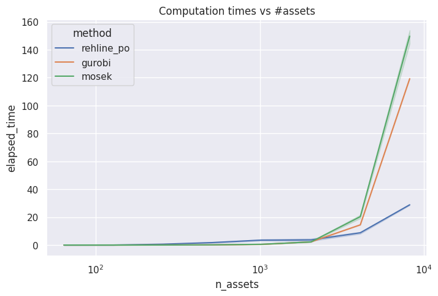
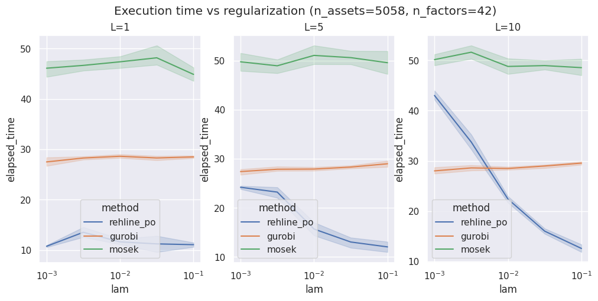

# ReHLine-PO

Fast mini-Portfolio Optimization solver fueled by [ReHLine](https://rehline.github.io/).
It is particularly good at solving the problems of the kind
$$\min_{\mathbf{w} \in \mathbb{R}^n} \frac{C}{2} \mathbf{w}^T G \mathbf{w} - \mu^T \mathbf{w} + \sum_{i=1}^n \phi_i(w_i)$$

where $\phi_i$ are piecewise linear convex cost functions, e.g. it could represent empirical market impact (from the orderbook) + cost from the spread.

## Table of contents
- [Installation](#installation)
- [Usage](#usage)
- [Benchmarks](#benchmarks)
- [Technical details](#technical-details)
- [Dependencies](#dependencies)
- [References](#references)

## Installation

```git clone https://github.com/softmin/ReHLine-PO.git```

## Usage


```python
# linear constraints Ax + b >= 0
A = np.r_[np.c_[np.ones(n), np.ones(n)*-1.0].T, np.eye(n)]
b = np.r_[-1.0, 1.0, np.zeros(n)]
# other variables (previous weights, transaction costs)
...
```

```python
from rehline_po import MeanVariance

pf = MeanVariance(mu, cov, A, b, w_prev, transaction_costs)
w = pf.max_quad_util_portf(tol, risk_aversion)
```

## Benchmarks

Benchmark against other convex solvers can be found in `benchmarks/`.




## Technical Details

As the naming suggests, ReHLine-PO is based on an optimization algorithm [ReHLine](https://rehline.github.io/).
Mathematical details of the implemetation can be found at 
[](https://github.com/keepwith/PLQComposite/blob/main/technical_details/)

## Dependencies

* Python 3.12+
* NumPy 1.26+
* SciPy 1.14+
* [PLQ-Composite-Decomposition](https://github.com/keepwith/PLQComposite)
* [ReHLine-python](https://github.com/softmin/ReHLine-python)

## References

- [1]  Dai, B., & Qiu, Y. (2023, November). ReHLine: Regularized Composite ReLU-ReHU Loss Minimization  with Linear Computation and Linear Convergence. In *Thirty-seventh Conference on Neural Information Processing Systems*.
